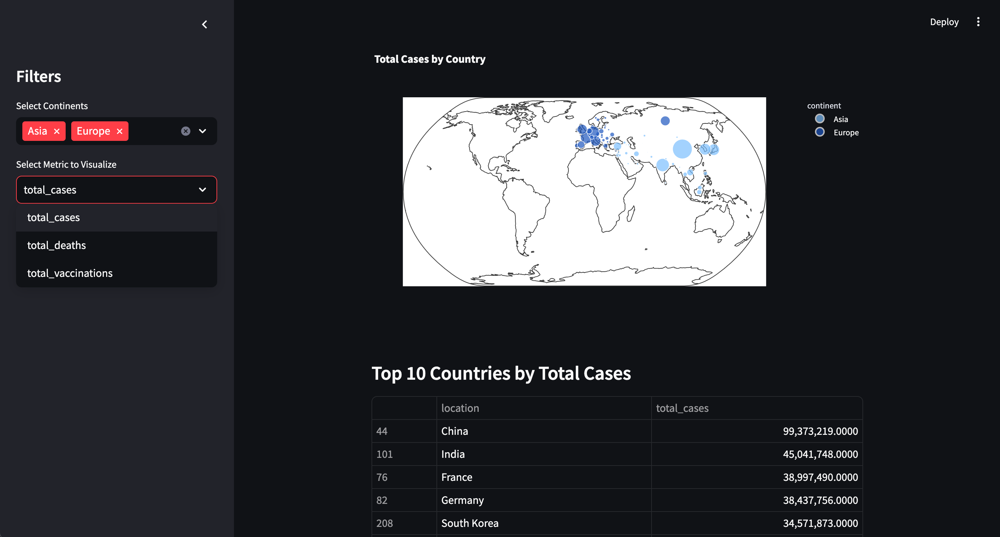

# **Demo Streamlit Dashboard with Docker and Kubernetes 🚀**

This repository contains a lightweight, interactive Covid-19 demo dashboard built using Streamlit, containerized with Docker, and ready for deployment on Kubernetes.

---

## **Features**
- 🖥️ **Interactive Dashboard**: Built with Streamlit for real-time data visualization.
- 📦 **Containerized Application**: Docker ensures portability and consistency.
- ☸️ **Scalable Deployment**: Ready for Kubernetes deployment with LoadBalancer service support.

---

## **Getting Started**

Follow these instructions to set up and run the project.

### **Prerequisites**
Make sure you have the following installed:
1. **Python 3.9+**
2. **Docker**
3. **Kubernetes (kubectl)** and a cluster (e.g., Minikube, GKE, EKS)
4. **Git**

---

### **1. Clone the Repository**
```
git clone https://github.com/kotharivineet/streamlit-deployment.git
cd streamlit-deployment
```

---

### **2. Run Locally**
Test the app locally using Streamlit:
```
pip install -r requirements.txt
streamlit run app.py
```
Access the dashboard at [http://localhost:8501](http://localhost:8501).

---

### **3. Build and Run with Docker**
Containerize the app using Docker:
1. Build the Docker image:
```
docker build -t streamlit .
```
2. Run the container:
```
docker run -p 8501:8501 streamlit
```
3. Open your browser and navigate to [http://localhost:8501](http://localhost:8501).

---

### **4. Push Docker Image to Registry**
To deploy on Kubernetes, first push your Docker image to a container registry:
```
docker tag streamlit_app <your-dockerhub-username>/streamlit-deployment:latest
docker push <your-dockerhub-username>/streamlit-deployment:latest
```

Here, [this](https://hub.docker.com/r/kotharivineet27/streamlit-deployment/tags) docker image from DockerHub will be used.

---

### **5. Deploy on Kubernetes**
Deploy the app on Kubernetes using the provided YAML configuration file.

1. Apply the deployment and service configuration:
```
kubectl apply -f streamlit-deployment.yaml
```
2. Verify that pods are running:
```
kubectl get pods
```
3. If kubernetes is being run locally, streamlit app can be viewed by port-forward:
```
kubectl port-forward service/streamlit-service 8501:80
```
then, open: [http://localhost:8501](http://localhost:8501)

---

## **Project Structure**
```bash
streamlit-deployment/
├── images/                     # Folder for images used in the project
│   └── Sample.png              # Sample image
├── app.py                      # Streamlit application code
├── Dockerfile                  # Docker configuration file
├── requirements.txt            # Python dependencies
├── streamlit-deployment.yaml   # Kubernetes deployment and service configuration
└── README.md                   # Project documentation
```

Here is an sample image from the app:




Data courtesy: [Our World in Data](https://ourworldindata.org/coronavirus)

---
**Thank You for visiting!**